**1. Subir archivos**

**1.1.Inicia sesión en ownCloud como administrador o usuario.**

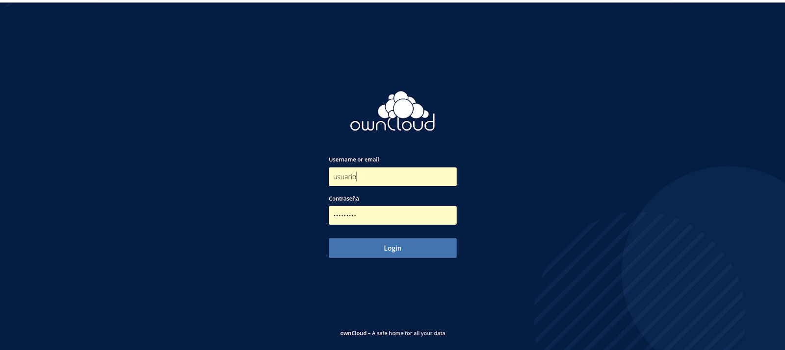

**1.2.En la página principal, haz clic en el botón *+* (más) en la parte superior.**

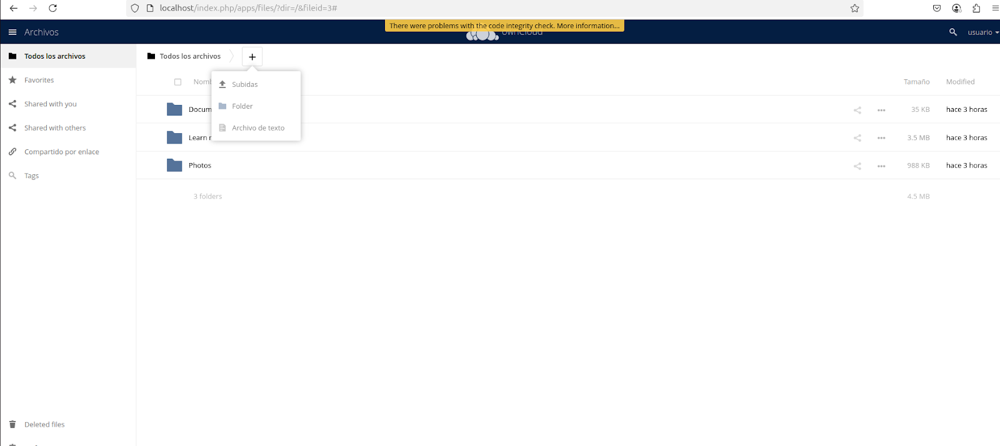

**1.3.Selecciona *Subir*.**

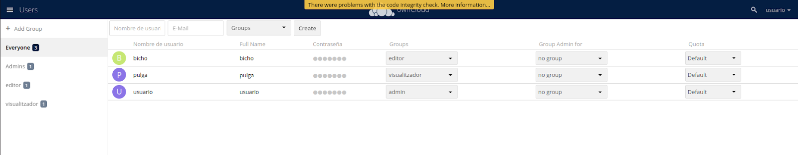

**1.4.Elige un archivo desde tu ordenador y confírmalo.**

*Verifica que aparezca en la lista de archivos.**

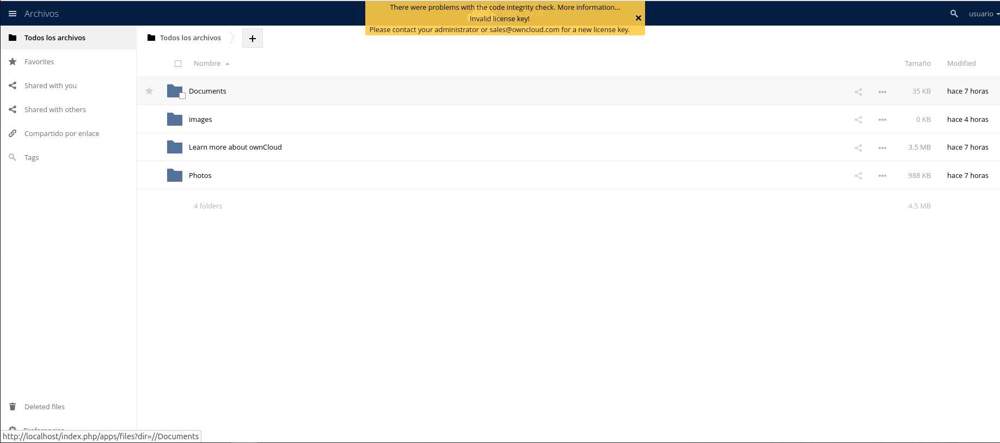

**____________________________________________________________________________________________________________________________________________________**

**2. Crear carpetas**

*Pulsa el botón “+” > “Nueva carpeta”*

**2.1.Escribe un nombre, por ejemplo Documentación, y presiona Enter.**

*Entra en la carpeta y asegúrate de que está vacía y funcional.*

**2.2.Compartir contenido**

*Haz clic en el icono de compartir junto a un archivo o carpeta.*

*Elige:*

*“Enlace público” → genera un enlace para compartir*.*

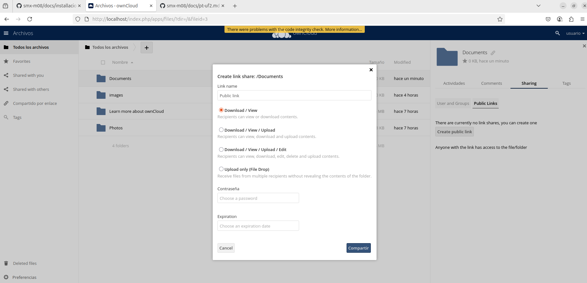

**2.3.*“Compartir con usuario” → escribe el nombre de otro usuario interno*.**

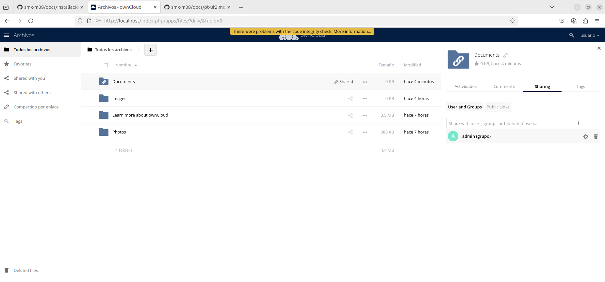

**2.4.Puedes configurar:**

*Fecha de caducidad*

*Permiso de escritura*

*Solo lectura*

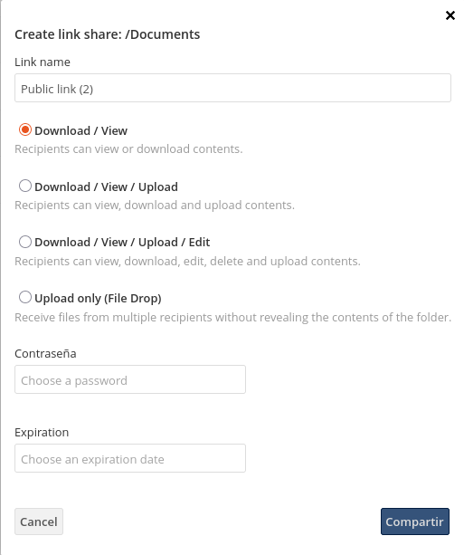

**____________________________________________________________________________________________________________________________________________________**

**3.1. Creación de usuarios**

*Crear tres usuarios con diferentes roles*

*Inicia sesión como usuario administrador.*

**3.2.Ve al icono de configuración (rueda dentada) > “Usuarios”.**

*Abajo:*

*Escribe el nombre del nuevo usuario (por ejemplo, editor1)*

*Asigna una contraseña*

*Asigna un grupo si es necesario (Editores, Lectores, Administradores)*

**3.3.Haz clic en “Crear”**

**Usuarios sugeridos:**

*admin1 → Administrador*

*editor1 → Editor (puede subir y modificar archivos)*

*lector1 → Visualizador (solo lectura)*

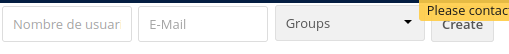

**____________________________________________________________________________________________________________________________________________________**

**4. Asignación de roles y permisos**

*Configurar permisos para cada rol*

**4.1.Crea carpetas específicas para cada grupo:**

*Carpeta_Admins, Carpeta_Editores, Carpeta_Lectores*

**4.2.Comparte cada carpeta con el grupo correspondiente:**

**4.3.Añade permisos:**

*Admin: leer, escribir, compartir, eliminar*

*Editor: leer y escribir*

*Lector: solo lectura*

**4.4.Verificar el acceso según el rol**

*Cierra sesión y accede con lector1.*

**4.5.Intenta:**

*Abrir archivos* 

*Editar o subir nuevos archivos (debe denegar)*

*Repite la prueba con editor1 y admin1.*

**____________________________________________________________________________________________________________________________________________________**

**5. Administración de archivo**

**5.1.Organizar archivos y carpetas**

*Crea subcarpetas dentro de cada carpeta de grupo (ej.: /Carpeta_Editores/Imágenes/, /Carpeta_Editores/Documentos/)*

*Mueve archivos a sus carpetas correspondientes.*

*Nombra y organiza el contenido de forma clara.*

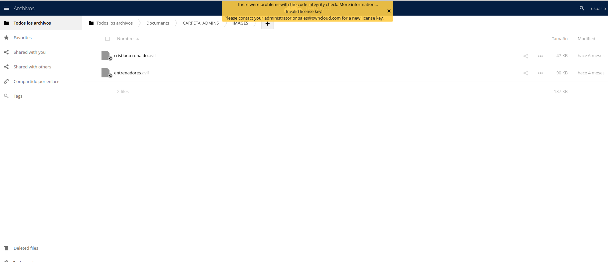

**____________________________________________________________________________________________________________________________________________________**

**6. Configurar políticas de seguridad**

**6.1.Al compartir un archivo o carpeta, activa:**

*Caducidad del enlace: marca la opción y elige una fecha.*

*Protección con contraseña: añade una contraseña si lo deseas.*

*Guarda los cambios.*

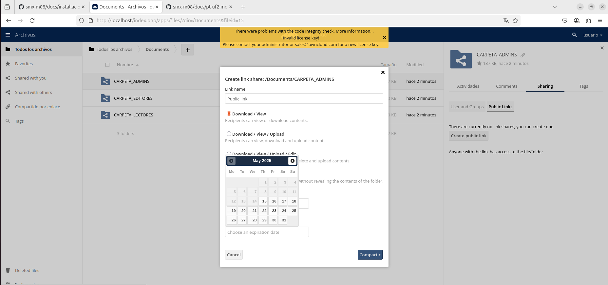

**____________________________________________________________________________________________________________________________________________________**

**7. Acceso desde otra máquina de la red**
  
**7.1.Configurar acceso remoto**

**En la máquina virtual, comprueba la IP con:**

*bash*

*Copiar*

*Editar*

*ip a*

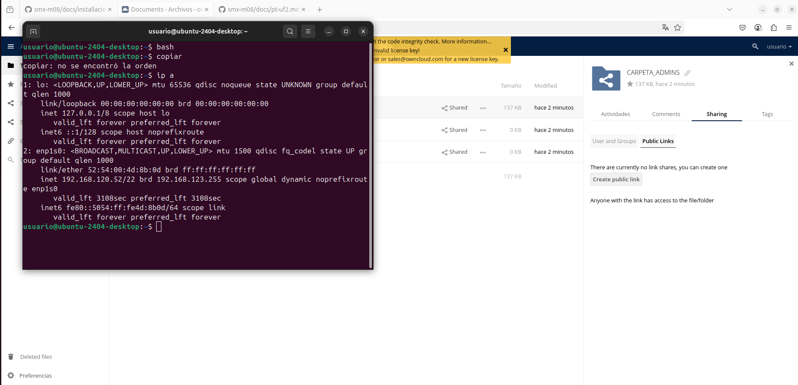

**7.2.Asegúrate de que el puerto 80 (HTTP) esté abierto.**

**Desde otro dispositivo de la misma red:**

*Abre el navegador.*

*Escribe http://<IP_de_la_VM>/owncloud*

*Inicia sesión con uno de los usuarios creados.*
