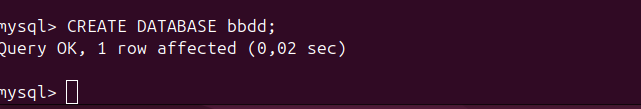
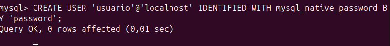
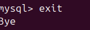
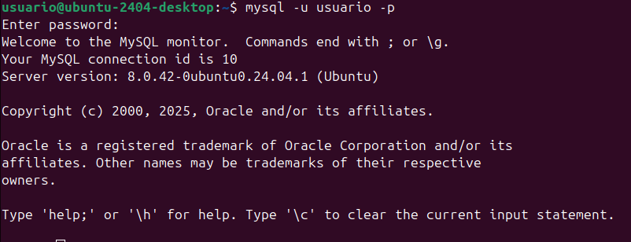
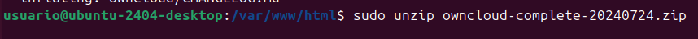
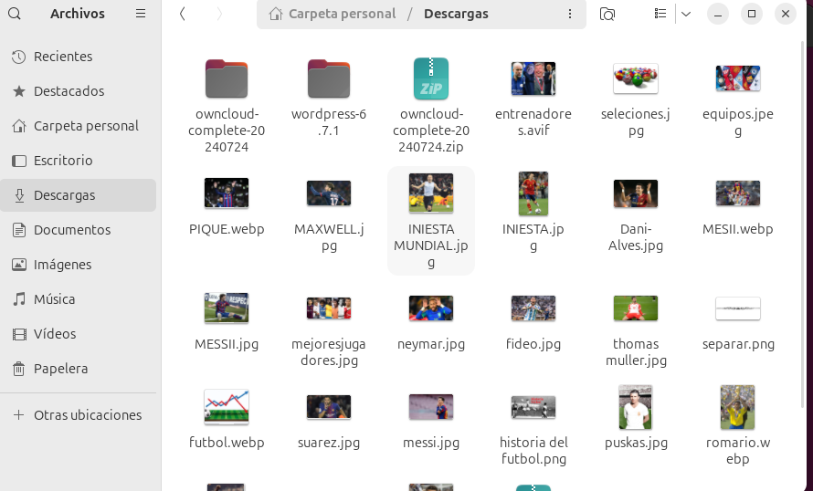

**1. Configuración de MySQL**
Accede a la consola de MySQL:

*sudo mysql*

**1.1. Creación de la base de datos**
Desde la consola de MySQL, crea una base de datos llamada bbdd (o el nombre que prefieras):

*CREATE DATABASE bbdd;*

**1.2. Creación de un usuario MySQL**
A continuación, crea un usuario con acceso a la base de datos bbdd. El siguiente comando crea un usuario llamado usuario con la contraseña password, y le da acceso solo desde localhost:

*CREATE USER 'usuario'@'localhost' IDENTIFIED WITH mysql_native_password BY 'password';*

**1.3. Otorgar privilegios al usuario**
Para otorgar privilegios completos al usuario para trabajar con la base de datos bbdd, ejecuta el siguiente comando:

*GRANT ALL ON bbdd. TO 'usuario'@'localhost';*

Finalmente, sal de la consola de MySQL:

*exit*

**1.4. Comprobar conexión**
Prueba que puedes conectarte a MySQL con el usuario y la contraseña creados:

*mysql -u usuario -p*

**____________________________________________________________________________________________________________________________________________________**

**2. Luego copias los archivos de la aplicación web al servidor**
Primero, asegurémonos de tener el archivo comprimido de la aplicación web en una ubicación accesible. En este ejemplo, se ha descargado el archivo app-web.zip en el directorio ~/Baixades (el directorio "Descargas" en catalán). Si el idioma de tu sistema es diferente, deberás adaptar el comando de acuerdo con la ruta en tu idioma.

**OwnCloud: http://www.owncloud.org**

**2.1. Copiar el archivo al directorio de Apache**
Para copiar el archivo comprimido de la aplicación web al directorio raíz de Apache (/var/www/html), utiliza el siguiente comando:

*sudo cp ~/Baixades/app-web.zip /var/www/html*

Nota: Si la carpeta "Baixades" no existe, debes modificar el comando para reflejar la ruta correcta donde descargaste el archivo ZIP.

**2.2. Acceder al directorio de Apache**
Luego, accedemos al directorio donde vamos a trabajar, que es /var/www/html, con el siguiente comando:

*cd /var/www/html*

**2.3. Descomprimir el archivo ZIP**
Descomprime el archivo ZIP que contiene la aplicación web con el siguiente comando:

*sudo unzip app-web.zip*

Esto descomprimirá el contenido del archivo ZIP en el directorio actual (/var/www/html).

**2.4. Mover los archivos a la ubicación adecuada**
A continuación, movemos el contenido descomprimido de la carpeta app-web a la raíz de /var/www/html. El nombre de la carpeta descomprimida puede variar, por lo que debes adaptarlo a la carpeta que se haya creado al descomprimir el archivo.

*sudo cp -R app-web/. /var/www/html*

**2.5. Eliminar la carpeta descomprimida**
Una vez que los archivos hayan sido copiados correctamente, puedes eliminar la carpeta descomprimida (app-web) para mantener tu sistema limpio:

*sudo rm -rf app-web/*

**2.6. Eliminar el archivo index.html predeterminado de Apache**
El archivo index.html que viene por defecto con Apache a veces puede interferir con el acceso a tu aplicación web. Por eso, eliminamos este archivo para evitar conflictos:

*sudo rm -rf /var/www/html/index.html*

**____________________________________________________________________________________________________________________________________________________**

**3. Configurar permisos de los archivos de la aplicación web**
Ahora que los archivos de la aplicación web están en el directorio /var/www/html, es necesario configurar los permisos adecuados para que Apache pueda acceder a ellos sin problemas.

**3.1. Establecer permisos correctos**
Establece los permisos de los archivos a 775 para permitir la escritura, lectura y ejecución a los propietarios y al grupo (en este caso, Apache):

*cd /var/www/html*

*sudo chmod -R 775 .*

**3.2. Cambiar propietario y grupo**
Cambia el propietario de los archivos a usuario y el grupo a www-data, que es el grupo usado por Apache en la mayoría de los sistemas Linux:

*sudo chown -R usuario:www-data .*

Esto asegura que Apache tenga los permisos necesarios para servir los archivos y que el usuario usuario (el que tiene acceso a la base de datos) pueda manipular los archivos si es necesario.

**____________________________________________________________________________________________________________________________________________________**

**4. Configurar la base de datos en la aplicación web**
Durante la instalación, la aplicación web te pedirá que introduzcas los detalles de la base de datos. Asegúrate de proporcionar la siguiente información:

*Usuario de la base de datos: usuario*
*Contraseña de la base de datos: password*
*Base de datos: bbdd*
*Dominio: localhost*
*Con esta información, la aplicación podrá conectarse correctamente a la base de datos MySQL que configuramos anteriormente.*

____________________________________________________________________________________________________________________________________________________

**5. Crear un usuario administrador**
En la siguiente pantalla, el instalador de la aplicación web te pedirá que crees un usuario administrador para acceder a la aplicación. Completa los campos con el nombre de usuario y la contraseña que desees, y guarda los cambios.

____________________________________________________________________________________________________________________________________________________

**6. Finalizar la instalación**
Una vez que hayas configurado la base de datos y creado un usuario administrador, la instalación de la aplicación web debería completarse. Ahora puedes acceder a la aplicación en cualquier momento usando la URL:

*http://localhost*

