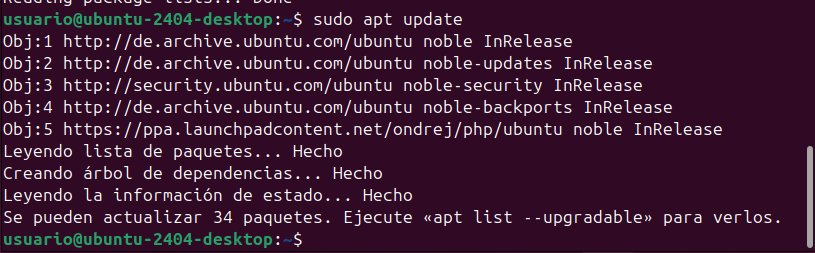
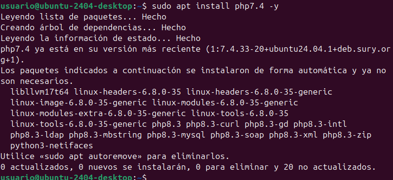
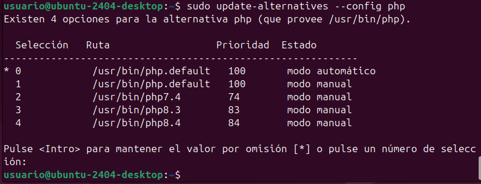
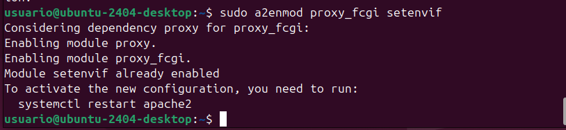
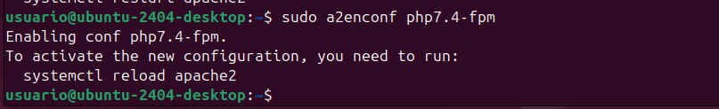
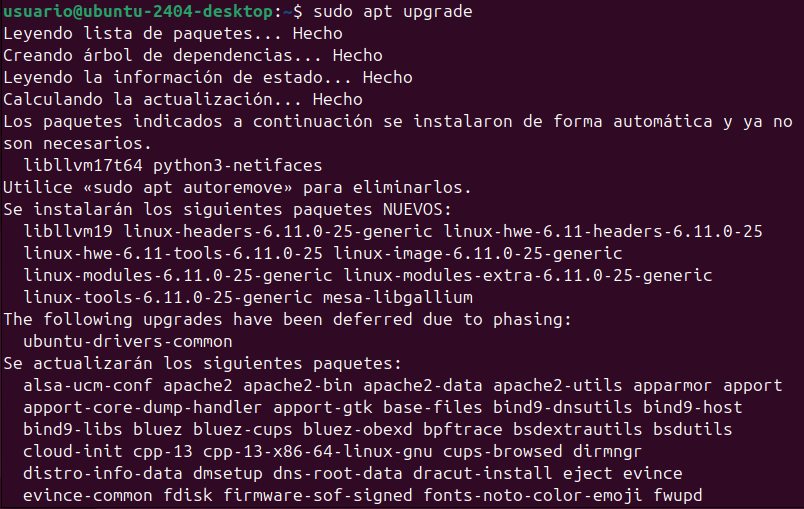
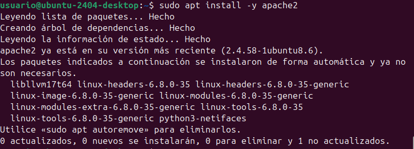
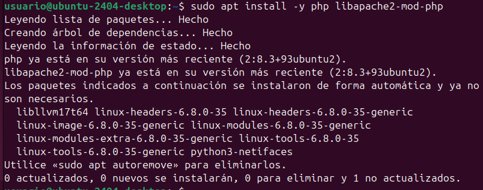
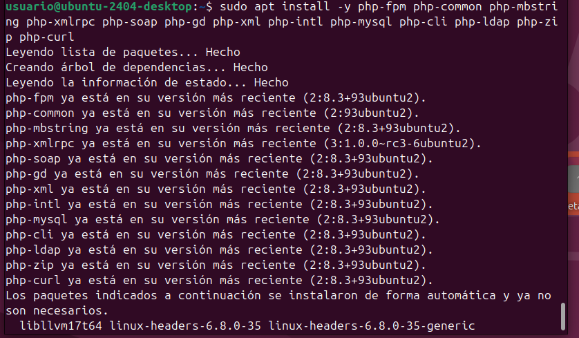

**1.1.Instal·lar la versió 7.4 de PHP a Ubuntu 24.04**

Per a poder instal·lar ownCloud necessitarem la versió 7.4 de PHP, per a instal·lar-la al nostre sistema haurem de fer les següents comandes:

Actualitza les llistes de paquets i actualitza tots els paquets existents al vostre sistema.

**1.2.Instal·leu els requisits previs de PPA:**

*sudo apt install software-properties-common -y*

**1.3.Instal·la les eines necessàries per treballar amb els arxius de paquets personals (PPA).**

*LC_ALL=C.UTF-8 sudo add-apt-repository ppa:ondrej/php -y*

**1.4.Actualitza ara els repositoris:**

*sudo apt update*

**1.5.Instal·la les llibreries de PHP de la versió 7.4**

*sudo apt install php7.4 -y*

*sudo apt install -y php libapache2-mod-php7.4*

*sudo apt install -y php7.4-fpm php7.4-common php7.4-mbstring php7.4-xmlrpc php7.4-soap php7.4-gd php7.4-xml php7.4-intl php7.4-mysql php7.4-cli php7.4-ldap php7.4-zip php7.4-curl*

**1.6.Seleccioneu la versió de PHP que voleu:**

*sudo update-alternatives --config php*

**1.7.Activa els mòduls d'apache2 necessaris:**

*sudo a2enmod proxy_fcgi setenvif*

*sudo a2enconf php7.4-fpm*

**1.8.Reinicieu l'apache2:**

*sudo service apache2 restart*

**____________________________________________________________________________________________________________________________________________________**

**2.1. ACTUALIZACIÓN DE LA MÁQUINA**

Primero, actualiza los repositorios e instala las últimas actualizaciones disponibles:

*(sudo apt update)*

*(sudo apt upgrade)*

**2.2. INSTALACIÓN DEL SERVIDOR WEB APACHE2**

Para instalar el servidor web Apache, utiliza el siguiente comando:

*(sudo apt install -y apache2)*

**2.3. INSTALACIÓN DEL SERVIDOR DE BASES DE DATOS MYSQL**

Instalar MySQL Server:

*(sudo apt install -y mysql-server)*

**2.4. INSTALACIÓN DE PHP Y BIBLIOTECAS NECESARIAS**

A continuación, instala PHP y las bibliotecas necesarias para integrarlo con Apache y MySQL:

*(sudo apt install -y php libapache2-mod-php)*

*(sudo apt install -y php-fpm php-common php-mbstring php-xmlrpc php-soap php-gd php-xml php-intl php-mysql php-cli php-ldap php-zip php-curl)*

**2.5. REINICIA APACHE PARA QUE LOS MODULOS DE PHP SE CARGUEN CORRECTAMENTE:**

*(sudo systemctl restart apache2)*

**____________________________________________________________________________________________________________________________________________________**

**3. AHORA TIENES QUE CONFIGURAR**
